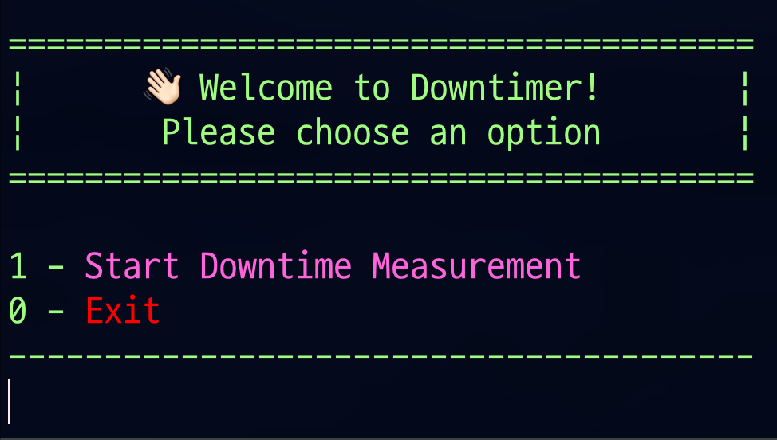

# ⏱️ Downtimer - v1.0.1

```shell
✅ 1.0.1 수정사항

- 엔드포인터 입력 단계에서 0(종료) 입력 시 곧바로 종료되지 않는 오류 수정
- docker 이미지 추가
```

<br><br>

## Introduction
> 프로그램을 만든 이유와 배경 설명

**Motivation**  
서버 프로그램의 업데이트와 재배포가 이루어질 때, 다운타임이 발생하게 됩니다. 도커를 활용하여 일반적인 방식으로 스프링 애플리케이션을 배포했을 때 
약 42초의 다운타임이 발생했습니다. 이러한 다운타임은 서비스 이용자 이탈로 이어질 수 있는 치명적인 문제라고 판단하여, 이를 해결하기 위해 
무중단 배포 방식을 적용하기로 결정했습니다.<br>  
하지만, 진정한 기술자는 무중단 배포를 적용하는 데에서 끝나는 것이 아니라, 실제로 적용 후 다운타임이 얼마나 감소했는지, 기존 방식과 비교했을 때 
얼마나 개선되었는지 수치로 측정하고 분석할 줄 알아야 한다고 생각합니다. 이 프로젝트는 이러한 목표를 실현하기 위해 만들어졌습니다.

<br><br>

## Features
> 프로그램 주요 기능

- 서버를 재배포했을 때 헬스체크 엔드포인트를 통해서 다운타임 측정


<br><br>


## How It Works
> 동작 방식

Step 1: 사용자가 특정 서버의 엔드포인트 URL을 입력합니다.  
Step 2: 프로그램이 지정된 URL로 주기적으로 요청을 전송하여 서버의 상태를 확인합니다.  
Step 3: 응답 코드가 200이 아닌 경우, 다운타임이 시작되었음을 기록하고 시간을 출력합니다.  
Step 4: 서버가 정상적으로 응답(200 OK)할 때까지 주기적으로 요청을 전송합니다.  
Step 5: 정상응답을 받고 다운타임이 종료되면 시작 시간과 종료 시간 및 다운타임을 출력합니다.  

<br><br>

## How to Use
> 사용 방법


### 실행환경
- Java 19.0.2

<br>

### 전제조건
- 서버의 헬스체크 엔드포인트 정상응답 코드 200
- 서버의 헬스체크 엔드포인트 cors 허용

<br>

### 실행 - CLI
1. **clone**: 터미널을 통해서 해당 레포지토리를 clone합니다.
```zsh
git clone https://github.com/photique-project/downtimer.git
```

<br>

2. **build**: clone 받은 downtimer 디렉터리로 이동하고 빌드명령어를 입력합니다.
```zsh
./gradlew clean build
```

<br>

3. **실행**: downtimer/build/libs 디렉터리에서 jar 파일을 실행시킵니다. 
```zsh
java -jar ./downtimer-1.0.0.jar
```

<br>

4. **명령어 입력**: 출력옵션에 따라서 올바른 명령어와 헬스체크 엔드포인트 입력합니다.



<br><br>


5. **서버 재배포**: 아래와 같은 단계에서 서버 재배포를 진행합니다.


<br><br>


6. **다운타임 확인**


<br><br>


### 실행 - Docker
1. **pull image**: 터미널을 통해서 downtimer 이미지를 내려받습니다
```zsh
docker pull photique/downtimer
```

<br>

2. **run**: 받은 이미지를 실행시킵니다
```zsh
docker run -it -p 8080:8080 photique/downtimer
```

<br><br>

## Contact
**📪 jms3847@gmail.com**